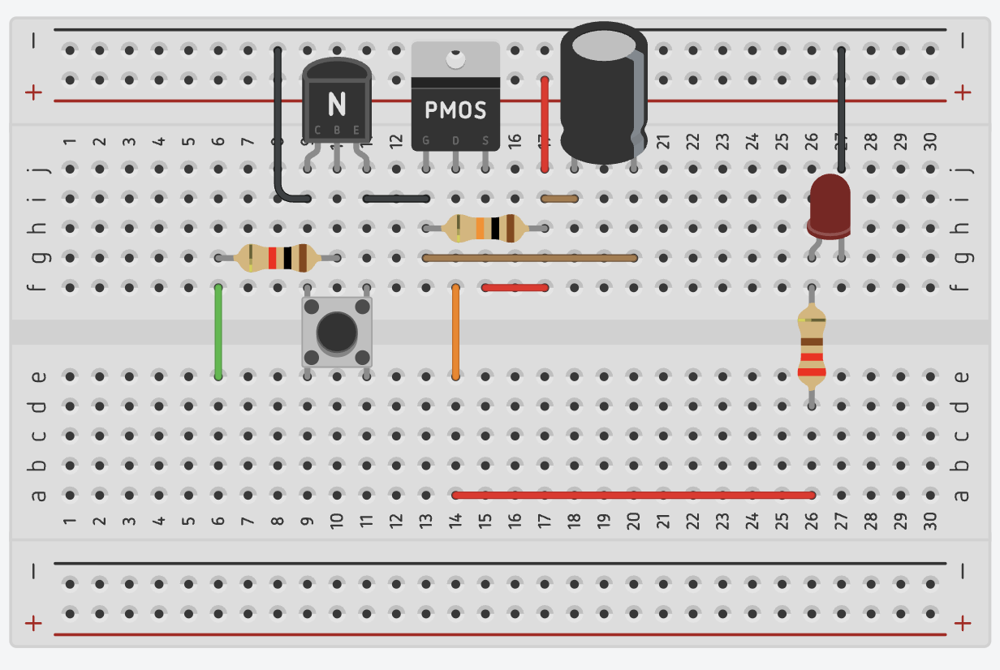
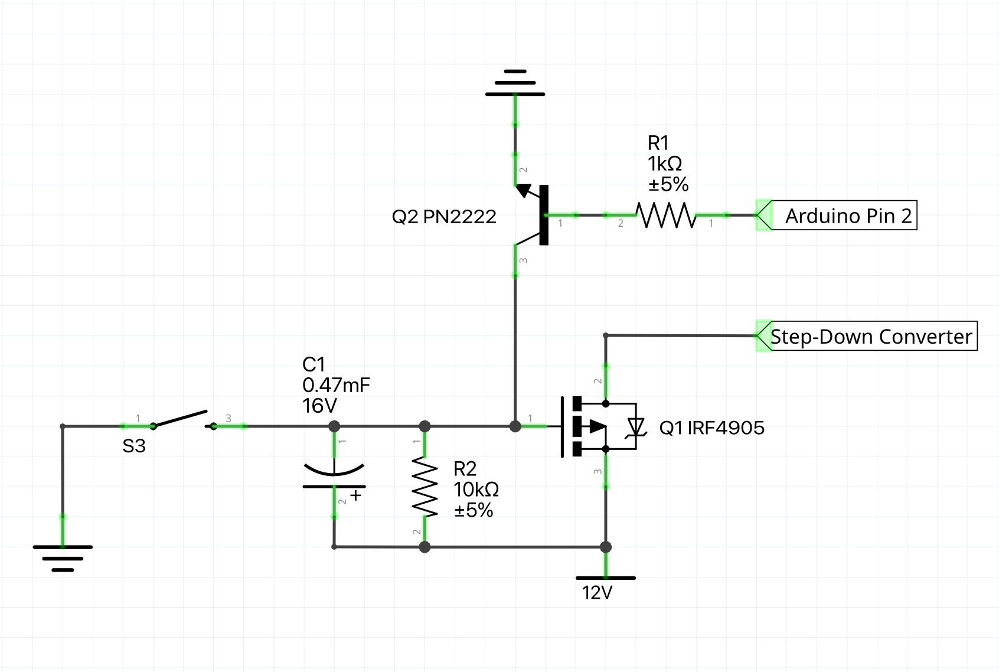
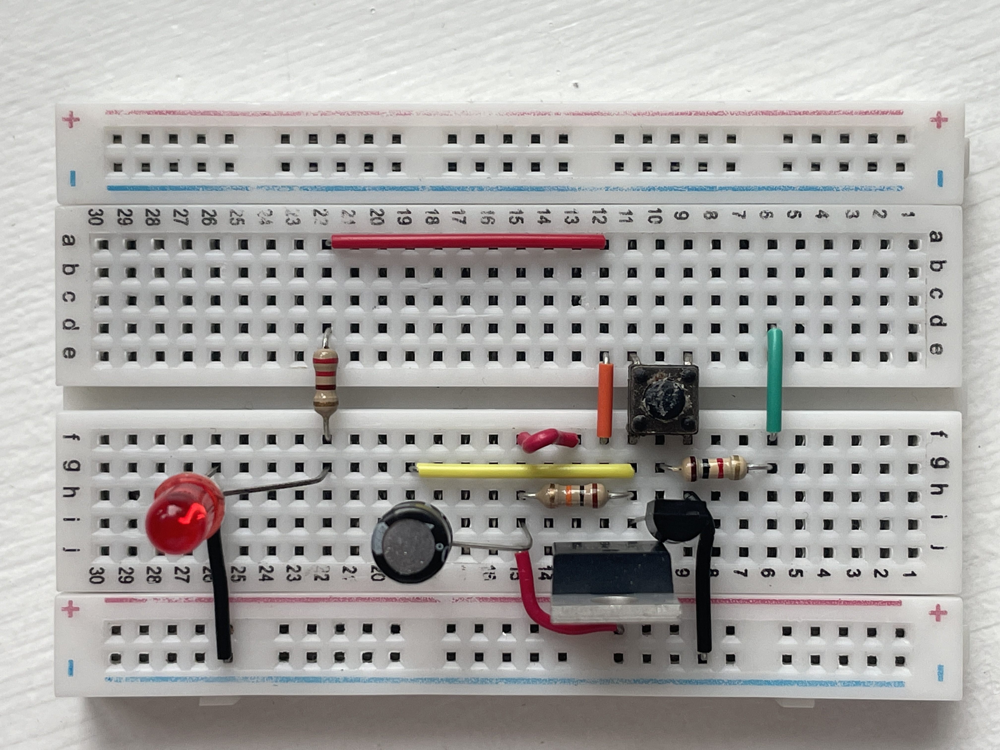
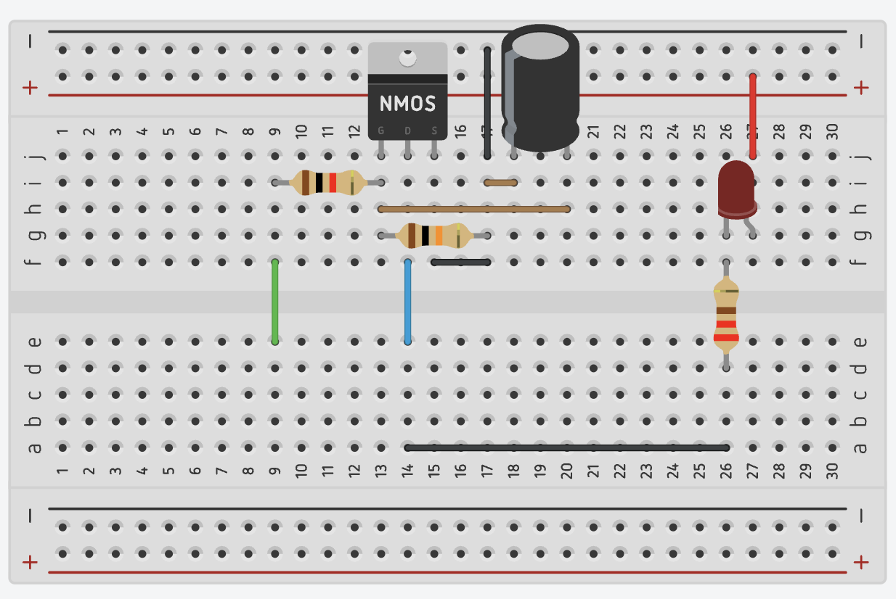
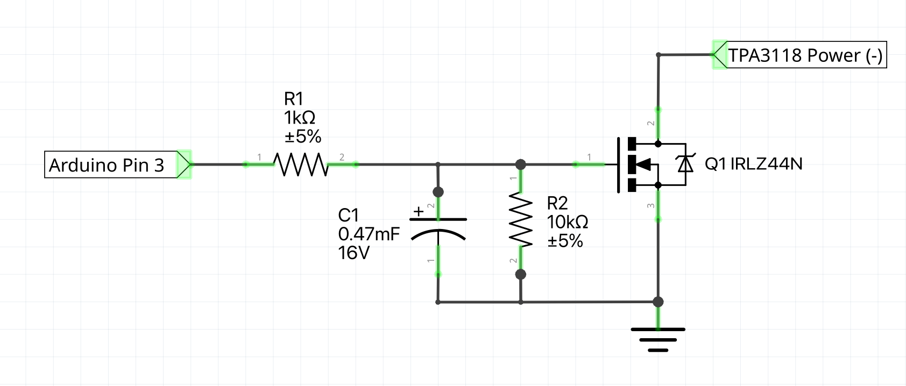
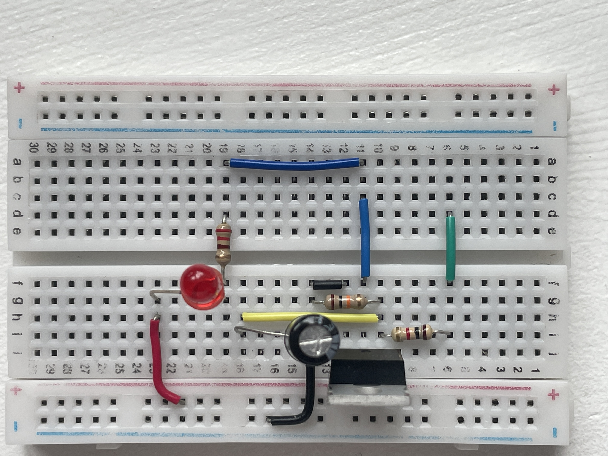

# Kanon i G3
Lydinstallation i Kanonstilling G3 ved Dueodde, Bornholm.

[Læs mere](https://www.genhoer.dk/kanon-i-g3)

Ved knaptryk tænder Arduino og holder latch i gang. Når Bela Mini er bootet startes afspilning og signal sendes til Arduino. Arduino tænder forstærkerne (4xTPA3118 moduler). Når afspilningen er slut går Bela Mini GPIO LOW og Arduino slukker forstærkere og herefter power latch.

Anlægget forsynes via en 12V 25Ah AGM Super Cycle batteri som oplades via MPPT 75/10 og solcellepanel (12V 55W).

## Power latch til forsyning af Arduino + Bela Mini

## Soft start (RC) til opstart af TPA3118 moduler

